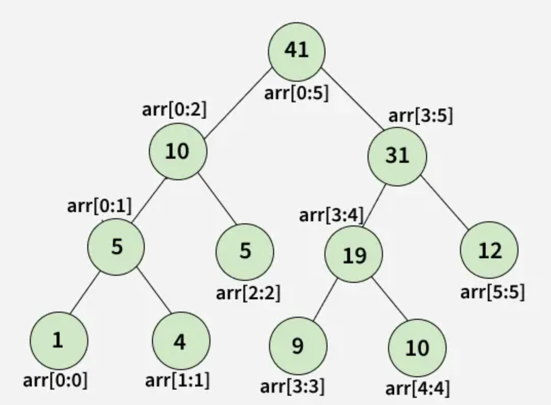

### Algorytm Kadane'a z wykorzystaniem Segment tree

# Sformułowanie problemu

Powiedzmy, że mamy tablicę dynamiczną liczb całkowitych i chcemy znaleźć w niej najdłuższy wspólny podciąg – wydaje się wtedy, że algorytm Kadane'a będzie optymalnym wyborem. Jednak pojawia się jeden poważny problem, mianowicie tablica jest dynamiczna, zatem gdy zmieni się w niej choć jeden element, musimy jeszcze raz ponownie wywołać Kadane'a, ponieważ w wyniku tego odpowiedź mogła ulec zmianie. Jeśli zamierzamy edytowac tablicę bardzo często, to jasnym staje się, że nie jest to najlepsze rozwiązanie. Na pomoc przychodzi nam bardzo ciekawa struktura danych - Segment tree.

# Wprowadzenie do Drzew Przedziałowych (Segment Trees)

Drzewo Przedziałowe to zaawansowana struktura danych, zaprojektowana w celu optymalizacji operacji na przedziałach elementów (najczęściej tablic). Pozwala na szybkie wykonywanie zapytań o dany przedział oraz równie szybkie aktualizowanie wartości poszczególnych elementów.

## Problem, który rozwiązuje Drzewo Przedziałowe

Wyobraźmy sobie tablicę `arr[0...n-1]` i dwa rodzaje operacji, które chcemy na niej wykonywać:

1. **Znalezienie sumy (lub innej wartości):** Chcemy obliczyć sumę (lub znaleźć minimum, maksimum itp.) elementów na przedziale od indeksu `L` do `R`, gdzie `0 <= L <= R <= n-1`.
2. **Aktualizacja (Point Update):** Chcemy zmienić wartość konkretnego elementu w tablicy, np. `arr[i] = x`.

### Standardowe podejścia (i ich wady)

* **Proste (Naiwne):**
  * Suma od `L` do `R` wymaga iteracji przez przedział, co zajmuje czas $O(n)$.
  * Aktualizacja jednego elementu jest błyskawiczna: $O(1)$.
* **Optymalizacja za pomocą Sum Prefiksowych:**
  * Suma od `L` do `R` jest natychmiastowa ($O(1)$) – wystarczy odjąć sumę do `L-1` od sumy do `R`.
  * Jednakże, jeśli zaktualizujemy element `arr[i]`, musimy przeliczyć wszystkie kolejne sumy prefiksowe, co zajmuje czas $O(n)$.

Oznacza to, że żadne z tych podejść nie jest optymalne, jeśli spodziewamy się wielu operacji obu typów. Tu właśnie pojawia się Drzewo Przedziałowe, które obie te operacje wykonuje w czasie logarytmicznym **$O(\log n)$**.

## Co to jest Drzewo Przedziałowe?

* **Definicja:** Jest to struktura danych używana m.in. do przechowywania informacji o przedziałach. Pozwala ona odpowiedzieć na pytania (zapytania) o dany przedział w czasie logarytmicznym, czyli $O(\log n)$.
* **Struktura:** Jest to pełne (lub prawie pełne) **Drzewo Binarne** (każdy węzeł ma zazwyczaj dwoje dzieci). Można je łatwo reprezentować za pomocą zwykłej, płaskiej tablicy.
* **Podstawowa zasada:** Liście drzewa przechowują pojedyncze elementy oryginalnej tablicy. Węzły wewnętrzne (te wyżej w hierarchii) przechowują zagregowane informacje (np. sumę, minimum) z przedziałów obejmujących ich "dzieci". Korzeń drzewa przechowuje informację dla całej tablicy `[0...n-1]`.

## Kluczowe Operacje

1. **Budowa (Build):**
   * Na początku tworzymy pełne drzewo. Proces ten jest inicjowany jednokrotnie z czasem wykonania **$O(n)$**.
2. **Zapytanie (Query):**
   * Służy do uzyskania wyniku dla zadanego przedziału, np. "Jaka jest suma elementów od indeksu 2 do 5?". Złożoność czasowa wynosi **$O(\log n)$**.
3. **Aktualizacja (Update):**
   * Służy do aktualizacji informacji zapisanych w drzewie, gdy zmieni się wartość pojedynczego elementu w oryginalnej tablicy. Aktualizowany jest dany liść, a następnie węzły na ścieżce od tego liścia do korzenia (aby zachować poprawne sumy/minima wyżej). Złożoność wynosi **$O(\log n)$**.

## Dlaczego $O(\log n)$? (Wizualizacja Złożoności)

Kiedy aktualizujemy element (np. w liściu), musimy zaktualizować tylko tych "rodziców", którzy zawierają ten element w swoim przedziale. Ścieżka od liścia do korzenia w pełnym drzewie binarnym ma długość logarytmiczną ($\approx \log_2 n$).

Podobnie przy zapytaniu, nie musimy sumować wszystkich elementów jeden po drugim. Jeśli potrzebujemy sumy przedziału, a w drzewie istnieje węzeł, który dokładnie pokrywa ten przedział (lub jego duży fragment), używamy tej gotowej wartości. W najgorszym razie musimy odwiedzić węzły wzdłuż ścieżek o głębokości drzewa.

# Przykład

`Arr = [1, 4, 5, 9, 10, 12]`

Wtedy Segment tree zliczające sumę wygląda w ten sposób:



# Implementacja

Segment tree można implementować na dwa sposoby: jako klasyczne drzewo binarne lub, częściej spotykane, za pomocą płaskiej tablicy.

Implementacja dla naszego problemu:

Najpierw zdefiniujmy, jak będzie wyglądać nasz Node:

```cpp
struct Node {
  long long sum; // suma prawego i lewego dziecka
  long long pref; // suma
  long long suff;
  long long ans;
};
